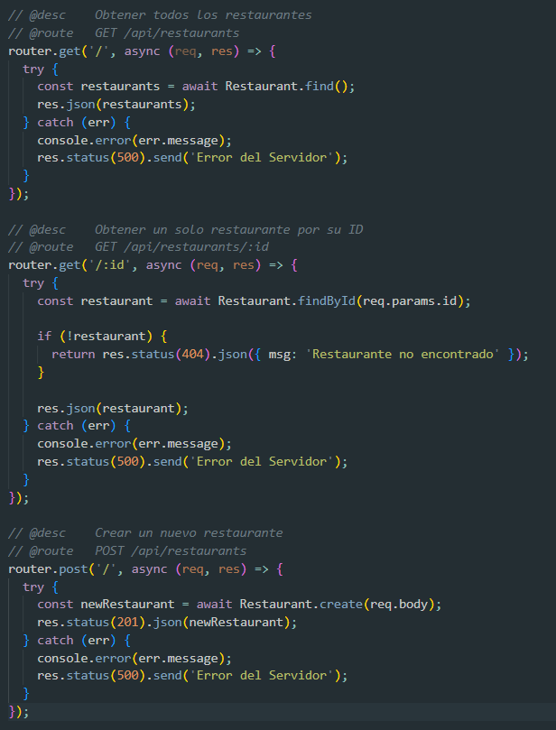

# Tattler API

A modern and dynamic restaurant directory backend service built with Node.js, Express.js, and MongoDB.

## Description

Tattler API is a RESTful backend service designed to power a comprehensive restaurant directory platform. Currently at the end of Sprint 2, the project has established a solid foundation with database configuration, data migration tools, and core CRUD operations for restaurant management. The API provides endpoints to retrieve and create restaurant entries, with plans to expand search and filtering capabilities in upcoming sprints.

## Features

- ✅ **Retrieve All Restaurants** - Fetch a complete list of restaurants from the database
- ✅ **Retrieve Single Restaurant** - Get detailed information about a specific restaurant by ID
- ✅ **Create Restaurant** - Add new restaurant entries to the database
- ✅ **MongoDB Integration** - Fully connected database with Mongoose ODM
- ✅ **Environment Configuration** - Secure configuration management with dotenv

## Tech Stack

- **Runtime:** Node.js
- **Framework:** Express.js
- **Database:** MongoDB
- **ODM:** Mongoose
- **Configuration:** dotenv

## Installation and Setup

### Prerequisites

Before running this project, ensure you have the following installed:

- [Node.js](https://nodejs.org/) (v14 or higher recommended)
- [MongoDB Server](https://www.mongodb.com/try/download/community) (running locally or remote instance)
- [MongoDB Database Tools](https://www.mongodb.com/try/download/database-tools) (for data import/export operations)

### Step-by-Step Setup

1. **Clone the Repository**
   ```bash
   git clone <your-repository-url>
   cd tattler-api
   ```

2. **Install Dependencies**
   ```bash
   npm install
   ```

3. **Configure Environment Variables**
   
   Create a `.env` file in the root directory of the project:
   ```bash
   touch .env
   ```
   
   Add your MongoDB connection string to the `.env` file:
   ```
   MONGO_URI=mongodb://localhost:27017/tattler_db
   ```
   
   *Note: Replace the URI with your MongoDB connection string if using a remote database or different configuration.*

4. **Start the Server**
   ```bash
   node server.js
   ```
   
   The server should start successfully and you'll see a confirmation message indicating the connection to MongoDB and the port number the server is running on.

## API Usage / Endpoints

### Base URL
```
http://localhost:3000/api
```



### 1. Get All Restaurants

Retrieves a list of all restaurants in the database.

- **Endpoint:** `GET /api/restaurants`
- **Description:** Returns an array of all restaurant objects
- **Response:** `200 OK`

**Example Request:**
```bash
curl http://localhost:3000/api/restaurants
```

**Example Response:**
```json
[
  {
    "_id": "507f1f77bcf86cd799439011",
    "name": "The Italian Corner",
    "cuisine": "Italian",
    "address": "123 Main St",
    "rating": 4.5,
    ...
  },
  {
    "_id": "507f1f77bcf86cd799439012",
    "name": "Sushi Palace",
    "cuisine": "Japanese",
    "address": "456 Oak Ave",
    "rating": 4.8,
    ...
  }
]
```

### 2. Get Restaurant by ID

Retrieves detailed information about a specific restaurant.

- **Endpoint:** `GET /api/restaurants/:id`
- **Description:** Returns a single restaurant object matching the provided ID
- **URL Parameters:** `id` - MongoDB ObjectId of the restaurant
- **Response:** `200 OK` or `404 Not Found`

**Example Request:**
```bash
curl http://localhost:3000/api/restaurants/507f1f77bcf86cd799439011
```

**Example Response:**
```json
{
  "_id": "507f1f77bcf86cd799439011",
  "name": "The Italian Corner",
  "cuisine": "Italian",
  "address": "123 Main St",
  "phone": "(555) 123-4567",
  "rating": 4.5,
  "priceRange": "$$"
}
```

### 3. Create New Restaurant

Adds a new restaurant to the database.

- **Endpoint:** `POST /api/restaurants`
- **Description:** Creates a new restaurant entry
- **Headers:** `Content-Type: application/json`
- **Response:** `201 Created` or `400 Bad Request`

**Example Request:**
```bash
curl -X POST http://localhost:3000/api/restaurants \
  -H "Content-Type: application/json" \
  -d '{
    "name": "Burger Haven",
    "cuisine": "American",
    "address": "789 Elm Street",
    "phone": "(555) 987-6543",
    "rating": 4.2,
    "priceRange": "$"
  }'
```

**Request Body Example:**
```json
{
  "name": "Burger Haven",
  "cuisine": "American",
  "address": "789 Elm Street",
  "phone": "(555) 987-6543",
  "rating": 4.2,
  "priceRange": "$"
}
```

**Example Response:**
```json
{
  "_id": "507f1f77bcf86cd799439013",
  "name": "Burger Haven",
  "cuisine": "American",
  "address": "789 Elm Street",
  "phone": "(555) 987-6543",
  "rating": 4.2,
  "priceRange": "$",
  "__v": 0
}
```

## Project Structure

```
tattler-api/
├── config/
│   └── db.js              # Database connection logic
├── models/
│   └── Restaurant.js      # Mongoose schema for Restaurant
├── routes/
│   └── restaurants.js     # API endpoint definitions
├── screenshots/
│   └── llamadas.png       # API endpoints code screenshot
├── .env                   # Environment variables (not in git)
├── server.js              # Main application entry point
└── package.json           # Project dependencies
```

## Next Steps (Sprint 3)

The upcoming sprint will focus on enhancing the API with advanced querying capabilities:

- 🔜 **Search Functionality** - Implement text search across restaurant names and descriptions
- 🔜 **Filtering Options** - Add filters by cuisine type, price range, and rating
- 🔜 **Sorting Capabilities** - Enable sorting results by various criteria
- 🔜 **Pagination** - Implement pagination for large result sets

---

**Project Status:** Sprint 2 Complete ✅ | Active Development 🚀