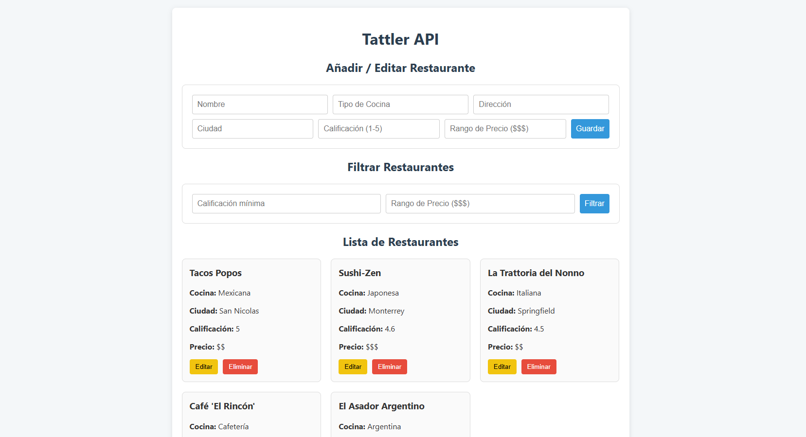
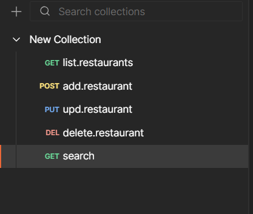

# Tattler API

A full-stack restaurant directory application with a complete RESTful backend API and an interactive web-based frontend client.

## Description

Tattler API is a comprehensive restaurant directory platform built with Node.js, Express.js, and MongoDB. The project features a robust backend API with full CRUD operations, advanced search capabilities, and dynamic filtering options. It also includes a single-page web interface that provides a visual demonstration of all API functionalities, allowing users to manage restaurant entries through an intuitive interface.



## Features

### Backend API
- ✅ **Complete CRUD Operations** - Create, Read, Update, and Delete restaurant entries
- ✅ **Advanced Text Search** - Search restaurants by name or description
- ✅ **Dynamic Filtering** - Filter restaurants by rating and price range
- ✅ **MongoDB Integration** - Fully connected database with Mongoose ODM
- ✅ **CORS Support** - Configured for cross-origin requests
- ✅ **Environment Configuration** - Secure configuration management with dotenv

### Frontend Client
- ✅ **Interactive Restaurant List** - View all restaurants in a clean, organized layout
- ✅ **Add New Restaurants** - User-friendly form to create restaurant entries
- ✅ **Edit Existing Restaurants** - Click-to-edit functionality with form pre-population
- ✅ **Delete Restaurants** - Remove entries with confirmation dialog
- ✅ **Real-time Filtering** - Filter restaurants by rating and price range
- ✅ **Single-file Implementation** - Complete frontend in one HTML file (HTML, CSS, and JavaScript)

## Tech Stack

**Backend:**
- Node.js
- Express.js
- MongoDB
- Mongoose
- dotenv
- cors

**Frontend:**
- HTML5
- CSS3
- Vanilla JavaScript
- Fetch API

## Installation and Setup

### Prerequisites

Before running this project, ensure you have the following installed:

- [Node.js](https://nodejs.org/) (v14 or higher recommended)
- [MongoDB Server](https://www.mongodb.com/try/download/community) (running locally or remote instance)
- A modern web browser (Chrome, Firefox, Safari, or Edge)

### Step-by-Step Setup

1. **Clone the Repository**
   ```bash
   git clone <your-repository-url>
   cd tattler-api
   ```

2. **Install Dependencies**
   ```bash
   npm install
   ```
   
   This will install all necessary packages including:
   - `express` - Web framework
   - `mongoose` - MongoDB ODM
   - `dotenv` - Environment variable management
   - `cors` - Cross-Origin Resource Sharing middleware (required for frontend-backend communication)

3. **Configure Environment Variables**
   
   Create a `.env` file in the root directory:
   ```bash
   touch .env
   ```
   
   Add your MongoDB connection string to the `.env` file:
   ```
   MONGO_URI=mongodb://localhost:27017/tattler_db
   ```
   
   *Note: Replace the URI with your MongoDB connection string if using a remote database or different configuration.*

4. **Why CORS is Required**
   
   The `cors` package is essential for this project because the frontend (`index.html`) runs on a different origin (typically `file://` or `http://127.0.0.1`) than the backend API (`http://localhost:3000`). Without CORS configuration, browsers block these cross-origin requests for security reasons. The `app.use(cors())` middleware in `server.js` enables the API to accept requests from any origin during development.

## Running the Project

### Starting the Backend

1. Ensure MongoDB is running on your system
2. Start the server:
   ```bash
   node server.js
   ```
3. You should see confirmation messages indicating:
   - Successful MongoDB connection
   - Server running on port 3000

**Expected Output:**
```
Server running on port 3000
MongoDB Connected
```

### Starting the Frontend

1. With the backend server running, simply open the `index.html` file in your web browser:
   - **Option 1:** Double-click the `index.html` file
   - **Option 2:** Right-click and select "Open with" your preferred browser
   - **Option 3:** Drag and drop the file into an open browser window

2. The frontend will automatically connect to the backend API at `http://localhost:3000`

**Important:** The backend server must be running before opening the frontend, otherwise the API calls will fail.

## API Usage / Endpoints

### Base URL
```
http://localhost:3000/api
```




### 1. Get All Restaurants

Retrieves a list of all restaurants in the database.

- **Endpoint:** `GET /api/restaurants`
- **Description:** Returns an array of all restaurant objects
- **Response:** `200 OK`

**Example Request:**
```bash
curl http://localhost:3000/api/restaurants
```

**Example Response:**
```json
[
  {
    "_id": "507f1f77bcf86cd799439011",
    "name": "The Italian Corner",
    "cuisine": "Italian",
    "address": "123 Main St",
    "phone": "(555) 123-4567",
    "rating": 4.5,
    "priceRange": "$$"
  }
]
```

---

### 2. Get Restaurant by ID

Retrieves detailed information about a specific restaurant.

- **Endpoint:** `GET /api/restaurants/:id`
- **Description:** Returns a single restaurant object matching the provided ID
- **URL Parameters:** `id` - MongoDB ObjectId of the restaurant
- **Response:** `200 OK` or `404 Not Found`

**Example Request:**
```bash
curl http://localhost:3000/api/restaurants/507f1f77bcf86cd799439011
```

**Example Response:**
```json
{
  "_id": "507f1f77bcf86cd799439011",
  "name": "The Italian Corner",
  "cuisine": "Italian",
  "address": "123 Main St",
  "phone": "(555) 123-4567",
  "rating": 4.5,
  "priceRange": "$$"
}
```

---

### 3. Create New Restaurant

Adds a new restaurant to the database.

- **Endpoint:** `POST /api/restaurants`
- **Description:** Creates a new restaurant entry
- **Headers:** `Content-Type: application/json`
- **Response:** `201 Created` or `400 Bad Request`

**Example Request:**
```bash
curl -X POST http://localhost:3000/api/restaurants \
  -H "Content-Type: application/json" \
  -d '{
    "name": "Burger Haven",
    "cuisine": "American",
    "address": "789 Elm Street",
    "phone": "(555) 987-6543",
    "rating": 4.2,
    "priceRange": "$"
  }'
```

**Request Body:**
```json
{
  "name": "Burger Haven",
  "cuisine": "American",
  "address": "789 Elm Street",
  "phone": "(555) 987-6543",
  "rating": 4.2,
  "priceRange": "$"
}
```

**Example Response:**
```json
{
  "_id": "507f1f77bcf86cd799439013",
  "name": "Burger Haven",
  "cuisine": "American",
  "address": "789 Elm Street",
  "phone": "(555) 987-6543",
  "rating": 4.2,
  "priceRange": "$",
  "__v": 0
}
```

---

### 4. Update Restaurant

Updates an existing restaurant's information.

- **Endpoint:** `PUT /api/restaurants/:id`
- **Description:** Updates a restaurant entry with new data
- **URL Parameters:** `id` - MongoDB ObjectId of the restaurant
- **Headers:** `Content-Type: application/json`
- **Response:** `200 OK` or `404 Not Found`

**Example Request:**
```bash
curl -X PUT http://localhost:3000/api/restaurants/507f1f77bcf86cd799439011 \
  -H "Content-Type: application/json" \
  -d '{
    "name": "The Italian Corner Bistro",
    "rating": 4.7,
    "priceRange": "$$$"
  }'
```

**Request Body:**
```json
{
  "name": "The Italian Corner Bistro",
  "rating": 4.7,
  "priceRange": "$$$"
}
```

**Example Response:**
```json
{
  "_id": "507f1f77bcf86cd799439011",
  "name": "The Italian Corner Bistro",
  "cuisine": "Italian",
  "address": "123 Main St",
  "phone": "(555) 123-4567",
  "rating": 4.7,
  "priceRange": "$$$"
}
```

---

### 5. Delete Restaurant

Removes a restaurant from the database.

- **Endpoint:** `DELETE /api/restaurants/:id`
- **Description:** Deletes a restaurant entry
- **URL Parameters:** `id` - MongoDB ObjectId of the restaurant
- **Response:** `200 OK` or `404 Not Found`

**Example Request:**
```bash
curl -X DELETE http://localhost:3000/api/restaurants/507f1f77bcf86cd799439013
```

**Example Response:**
```json
{
  "message": "Restaurant deleted successfully"
}
```

---

### 6. Search Restaurants

Search for restaurants by name or description using text search.

- **Endpoint:** `GET /api/restaurants/search?q=query`
- **Description:** Returns restaurants matching the search query
- **Query Parameters:** `q` - Search term
- **Response:** `200 OK`

**Example Request:**
```bash
curl "http://localhost:3000/api/restaurants/search?q=italian"
```

**Example Response:**
```json
[
  {
    "_id": "507f1f77bcf86cd799439011",
    "name": "The Italian Corner",
    "cuisine": "Italian",
    "address": "123 Main St",
    "rating": 4.5,
    "priceRange": "$$"
  }
]
```

---

### 7. Filter Restaurants

Filter restaurants by rating and/or price range.

- **Endpoint:** `GET /api/restaurants/filter?rating=value&price=value`
- **Description:** Returns filtered restaurants based on criteria
- **Query Parameters:** 
  - `rating` (optional) - Minimum rating (e.g., 4, 4.5)
  - `price` (optional) - Price range ($, $$, $$$, $$$$)
- **Response:** `200 OK`

**Example Request (by rating):**
```bash
curl "http://localhost:3000/api/restaurants/filter?rating=4.5"
```

**Example Request (by price):**
```bash
curl "http://localhost:3000/api/restaurants/filter?price=$$"
```

**Example Request (by both):**
```bash
curl "http://localhost:3000/api/restaurants/filter?rating=4&price=$$"
```

**Example Response:**
```json
[
  {
    "_id": "507f1f77bcf86cd799439011",
    "name": "The Italian Corner",
    "cuisine": "Italian",
    "address": "123 Main St",
    "rating": 4.5,
    "priceRange": "$$"
  }
]
```

## Demo Frontend Client

The `index.html` file serves as a fully functional demonstration client for the Tattler API. This single-page application provides an intuitive interface to interact with all API endpoints without requiring any command-line tools.

**Features of the Frontend Client:**

- **Restaurant Gallery**: Displays all restaurants in styled cards with complete information
- **Add Restaurant Form**: Easy-to-use form for creating new restaurant entries
- **Edit Functionality**: Click the "Edit" button on any restaurant card to load its data into the form for modification
- **Delete with Confirmation**: Remove restaurants with a browser confirmation dialog to prevent accidental deletions
- **Live Filtering**: Use dropdown menus to filter restaurants by minimum rating and price range
- **Responsive Design**: Clean, modern interface that works on desktop and mobile browsers

The frontend communicates with the backend API using the Fetch API, demonstrating real-world integration between a client application and a RESTful API.

## Project Structure

```
tattler-api/
├── config/
│   └── db.js              # Database connection configuration
├── models/
│   └── Restaurant.js      # Mongoose schema and model
├── routes/
│   └── restaurants.js     # API route definitions and handlers
├── screenshots/
│   └── llamadas.png       # API endpoints reference image
├── .env                   # Environment variables (not in git)
├── .gitignore             # Git ignore rules
├── index.html             # Frontend client application
├── server.js              # Main application entry point
├── package.json           # Project dependencies and scripts
└── README.md              # This file
```